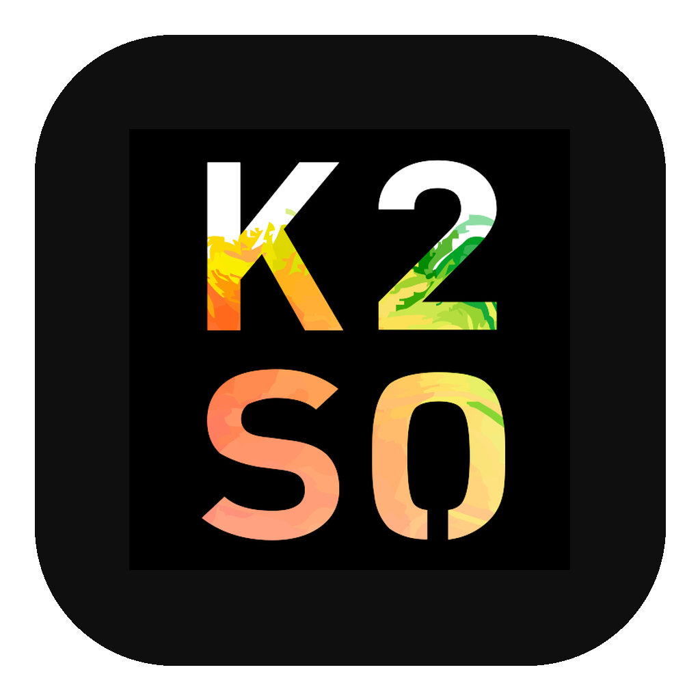

<p align="center">
  
</p>

<h1 align="center">K2SO</h1>

<p align="center">
  <strong>Your AI Workspace IDE</strong>
</p>

<p align="center">
  <a href="https://github.com/Alakazam-211/K2SO/blob/main/LICENSE"></a>
  <a href="https://k2so.sh"></a>
  
  
</p>

---

K2SO is **not a traditional IDE**. It is a workspace for orchestrating AI coding agents through CLI tools, managing git worktrees, and reviewing documents -- all from a terminal-first interface built with Tauri and Rust.

Think of it as a command center: you add your projects, launch AI agents (Claude, Codex, Gemini, Copilot, Aider, and more) in GPU-accelerated terminals, review markdown and PDFs in dark-themed viewers, and organize everything with focus groups and workspace layouts.

<!-- TODO: Add screenshot -->
<!--  -->

## Features

### AI Workspace Assistant (Cmd+L)
A local LLM (GGUF via llama.cpp with Metal acceleration) translates natural language into workspace operations -- split panes, open files, launch terminals, arrange layouts -- without leaving the keyboard.

### CLI Agent Integration
Quick-launch buttons for the agents you already use:
- **Claude** -- `claude --dangerously-skip-permissions`
- **Codex** -- `codex` with configurable reasoning effort
- **Gemini** -- `gemini --yolo`
- **Copilot** -- `copilot --allow-all`
- **Aider**, **Cursor Agent**, **OpenCode**, **Code Puppy**

Add your own custom agent presets or edit the built-ins. Set a default agent and launch it instantly with Cmd+Shift+T.

### Autonomous Agent System (BETA)

K2SO includes a closed-loop agent orchestration system where agents at every level are self-aware, self-configuring, and event-driven.

**Agent Hierarchy:**
- **K2SO Agent** -- Top-level planner that coordinates across workspaces, creates PRDs and milestones
- **Pod Leaders** -- Per-workspace orchestrators that delegate work to pod members, review completed branches
- **Pod Members** -- Specialized agents (backend-eng, frontend-eng, qa-tester) that work in isolated worktrees
- **Custom Agents** -- User-defined agents with adaptive heartbeat timing

**Adaptive Heartbeat with Local LLM Triage:**
The heartbeat system uses a two-tier cost model. A local LLM (Qwen 1.5B, running on-device via llama.cpp with Metal acceleration) evaluates whether expensive cloud sessions should be launched. The flow: filesystem check ($0) -> lock check ($0) -> quality gate ($0) -> local LLM decision ($0) -> cloud model session (only if the LLM approves). Agents self-adjust their check-in frequency (1 min during active work, 1 hour when idle). Auto-backoff increases the interval by 1.5x after 3 consecutive idle wakes. Active hours windows prevent overnight cost waste.

**Event-Driven via Claude Code Channels:**
Pod Leaders can run as persistent Claude sessions with MCP channel integration (`--channels`). K2SO implements an MCP channel server that pushes events (new work items, git changes, CI results, agent lifecycle events) directly into the running session. No polling delay, no context reload -- the agent maintains full session context across events.

**Self-Configuring Agents:**
Pod Leaders create and configure Pod Members via CLI (`k2so agent create`, `k2so agent update`). Agent profiles (`agent.md`) are editable with AI assistance via the built-in AIFileEditor. Each Pod Leader knows its team members' strengths by reading their `agent.md` files before delegating.

**Decentralized Work Discovery:**
Each Pod Leader knows where to find work (GitHub Issues, Linear, PRDs) via its `agent.md`. No central scanner or integration layer needed -- agents use CLI tools (`gh`, `git`, `curl`) already available in the terminal. The filesystem work queue (`.k2so/agents/{name}/work/{inbox,active,done}/`) is the always-on mechanism, scanned by the local LLM triage at near-zero cost.

**Multi-Terminal Execution:**
Agents can spawn parallel sub-terminals for concurrent tasks (`k2so terminal spawn`). Sub-terminals appear as pane splits within the agent's tab.

**Session Resume & Transcript Pruning:**
Heartbeat agents use Claude Code's `--resume` flag to continue from their last session, avoiding full context reload on each wake. No-op sessions (agent woke up, found nothing to do) are pruned automatically -- the session ID is cleared so the next launch starts fresh.

**Launch Failure Detection:**
If an agent's terminal exits within 5 seconds of starting, K2SO treats it as a launch failure, notifies the user, and retries once after 30 seconds.

### Workspace States

Each workspace operates under a configurable **state** that controls what agents can do automatically. States define per-capability permissions using a three-level model:

- **Auto** -- agents build and merge without asking
- **Gated** -- agents build PRs and publish review URLs, but wait for human approval before merging
- **Off** -- agents don't act on this type of work

Work items are tagged by source type (feature, issue, crash, security, audit, manual), and the workspace state gates which sources agents can auto-act on.

**Default States:**

| State | Features | Issues | Crashes | Security | Audits |
|-------|----------|--------|---------|----------|--------|
| **Build** | Auto | Auto | Auto | Auto | Auto |
| **Managed Service** | Gated | Auto | Auto | Auto | Gated |
| **Maintenance** | Off | Gated | Gated | Gated | Gated |
| **Locked** | Off | Off | Off | Off | Off |

Users can create custom states with any combination of capability levels. States are defined in Settings and assigned per-workspace.

### Agent Lifecycle Detection
K2SO detects when AI agents start, stop, or request permissions via a hook system that integrates with Claude Code, Cursor, and Gemini CLI. Active agents show real-time status indicators (working, awaiting permission, done) in the sidebar.

### Active Workspaces Dock
A collapsible dock at the bottom of the sidebar shows projects with running agents or recent activity. Switch between active workspaces with Cmd+1-9. Projects appear automatically when agents run and can be pinned or dismissed.

### Document Review
View `.md`, `.pdf`, and `.docx` files inline with a dark-themed viewer. Markdown renders with GFM support; PDFs use pdf.js; Word docs convert via mammoth.

### Terminal-First
GPU-accelerated terminals powered by [Alacritty](https://github.com/alacritty/alacritty)'s terminal emulator library, rendered via a custom DOM-based frontend. Split into up to 3 independent tab group columns, each with their own tab bar. Drag tabs between columns. Resize columns freely. Natural text editing (macOS-style Opt+Arrow word navigation, Cmd+Arrow line navigation) enabled by default.

### Chat History & Session Resume
View Claude and Cursor chat history in the sidebar. Click a session to resume it. When the app closes, terminal sessions are saved and resumed on reopen with `--resume` flags. Fresh chat tabs auto-rename to match the conversation title.

### Terminal Persistence
Terminal PTYs survive tab switches via a scrollback buffer architecture. Switch tabs freely without losing terminal state -- output is buffered and replayed on reattach.

### Git Worktree Management
First-class support for git worktrees. Create worktrees from new or existing branches. Automatic workspace record creation. Projects can run in worktree mode or standard mode.

### Focus Groups & Pinned Workspaces
Group related projects together with focus groups. Pin specific workspaces above the focus group filter so they're always accessible regardless of which group is active. Cmd+Shift+1-9 switches between pinned workspaces (swappable with active shortcuts in settings).

### Layout Persistence
Workspace layouts (tab groups, open documents, terminal sessions) save and restore automatically when you switch between workspaces. Panel tab arrangement and sidebar state persist across app restarts.

### Keyboard Shortcuts
- **Cmd+1-9** -- Switch active workspaces
- **Cmd+Shift+1-9** -- Switch pinned workspaces
- **Cmd+Shift+T** -- Launch default AI agent
- **Cmd+T** -- New terminal tab
- **Cmd+D** -- Split pane
- **Cmd+L** -- AI Workspace Assistant
- **Cmd+K** -- Quick switcher

### Icon Cropping
Upload custom workspace icons with a built-in crop dialog -- drag to position, scroll to zoom, apply to save.

### Built with Tauri + Rust
~5MB binary. Native PTY management via `portable-pty`. Alacritty terminal emulator for rendering. SQLite database via `rusqlite`. Git operations via `git2`. Local LLM inference via `llama-cpp-2`. No Electron, no bloat.

## Installation

### Download
Get the latest release from [k2so.sh](https://k2so.sh) or the [GitHub Releases](https://github.com/Alakazam-211/K2SO/releases) page.

### Build from Source

**Prerequisites:**
- [Rust](https://rustup.rs/) (stable)
- [Node.js](https://nodejs.org/) 18+ (or [Bun](https://bun.sh/))
- cmake (for llama.cpp compilation)
- Xcode Command Line Tools (macOS)

```bash
git clone https://github.com/Alakazam-211/K2SO.git
cd K2SO
npm install
cargo tauri dev
```

For a release build:

```bash
cargo tauri build
```

## Architecture

```
┌─────────────────────────────────────────────────────┐
│                   React 19 Frontend                 │
│  Zustand stores  │  Alacritty terminals  │  Viewers │
├─────────────────────────────────────────────────────┤
│                  Tauri v2 IPC Bridge                │
├─────────────────────────────────────────────────────┤
│                    Rust Backend                     │
│  portable-pty │ rusqlite │ git2 │ llama-cpp-2       │
├─────────────────────────────────────────────────────┤
│              Agent Orchestration Layer              │
│  Heartbeat scheduler │ CLI bridge │ Event queues    │
│  MCP channel server  │ Work queues │ Worktrees      │
└─────────────────────────────────────────────────────┘
```

| Layer | Tech | Purpose |
|-------|------|---------|
| Frontend | React 19, TailwindCSS v4, Zustand | UI and state management |
| Terminals | Alacritty terminal library, custom DOM renderer | GPU-accelerated terminal emulation |
| IPC | Tauri commands + events | Frontend-backend communication |
| Backend | Rust, Tauri v2 | Terminal PTY, database, git, LLM |
| Database | SQLite (rusqlite, WAL mode) | Projects, workspaces, presets, settings |
| AI | llama-cpp-2 (Metal) | Local LLM for workspace assistant + heartbeat triage |
| Agent Hooks | HTTP notification server | Lifecycle detection for Claude/Cursor/Gemini |
| Agent System | k2so CLI, heartbeat scheduler, MCP channels | Autonomous agent orchestration |
| Git | git2 | Worktree and branch management |

For the full technical architecture, see [docs/ARCHITECTURE.md](docs/ARCHITECTURE.md).

## Testing

Tests live in the `tests/` directory. Run them against a running K2SO instance.

### CLI Integration Tests

Tests all CLI commands end-to-end against a live K2SO instance:

```bash
# 1. Start K2SO
cargo tauri dev

# 2. Create a test workspace (one-time setup)
mkdir -p ~/DevProjects/k2so-cli-test && cd ~/DevProjects/k2so-cli-test && git init

# 3. Run the test suite
./tests/cli-integration-test.sh
```

The test suite covers: agentic systems toggle, workspace states, agent CRUD, work items with source tags, heartbeat management (set/get/force/noop/action), triage, terminal spawn, worktree management, and settings. All test data is cleaned up automatically.

Set `TEST_WORKSPACE` to use a different workspace path:
```bash
TEST_WORKSPACE=/path/to/workspace ./tests/cli-integration-test.sh
```

## Contributing

See [CONTRIBUTING.md](CONTRIBUTING.md) for development setup, project structure, and how to add new agent presets, document viewers, and workspace primitives.

## License

[MIT](LICENSE)
